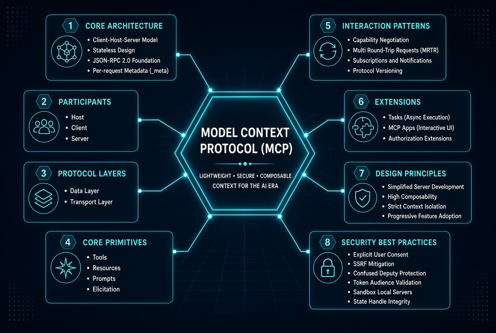

# Learn MCP



Personal study console for Model Context Protocol revision **2026-07-28**: host/client/server, tools/resources/prompts, Streamable HTTP, MRTR, subscriptions, Tasks extension, security habits, and a migration drill.

**Study material only.** Not an official MCP product. Not affiliated with Anthropic or the MCP steering group.

**Live:** https://aaronmeis.github.io/learn-mcp/

**Disclaimer:** [disclaimer.md](./disclaimer.md)

## What's here

- `index.html` (+ `cards-data.json`, `study-data.json`, `shorts-catalog.json`, `media/`, `assets/`): the study console. No build step. Flashcards, quiz, glossary, showcase, readings, resources, capstone, shorts gallery.
- `cheat-sheet.html`: letter-sized one-page cheat sheet (Print → Save as PDF).
- `assets-src/`: Gamma deck sketch and NotebookLM week briefs.
- `prompts/`: briefing, Socratic examiner, migration drill, security review, skills vs MCP lab.

## Running locally

Open `index.html` in a browser, or:

```bash
npx serve .
```

## Spec pin

- https://modelcontextprotocol.io/specification/2026-07-28/
- https://modelcontextprotocol.io/specification/2026-07-28/changelog
- https://blog.modelcontextprotocol.io/posts/2026-07-28/

## Secrets

This repo contains no API keys, OAuth client secrets, cookies, or private calendars. Do not add them.
